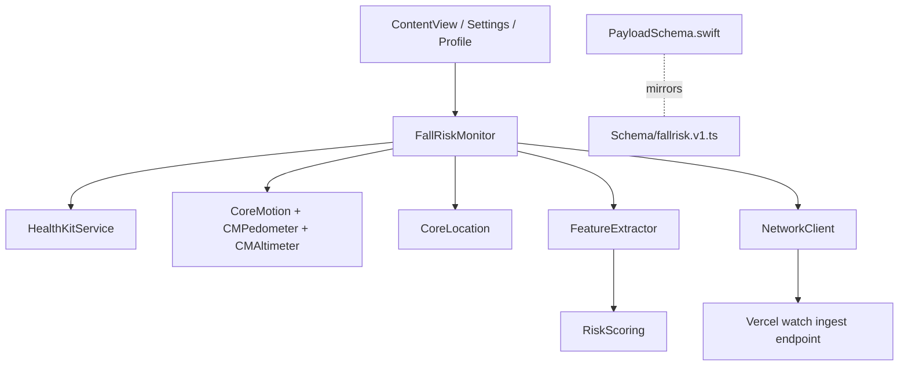

# Design Document

## Overview

The fall-risk monitor is a watch-first SwiftUI app centered on `FallRiskMonitor`, an `ObservableObject` that coordinates permissions, runtime state, feature extraction, risk scoring, event construction, and network posting. The design favors explainable derived features over raw data upload.

## Architecture

## Components

### FallRiskMonitor

Responsibilities:

- Own published watch UI state.
- Manage profile persistence through `ProfileStore`.
- Start and stop HealthKit workout sessions.
- Start and stop Core Motion, pedometer, altimeter, and location updates.
- Build `feature_window`, `instability_event`, `healthkit_snapshot`, `profile_snapshot`, and `session_summary` envelopes.
- Post envelopes with increasing sequence numbers.

### FeatureExtractor

Responsibilities:

- Convert short motion windows into derived metrics.
- Classify activity coarsely as standing, walking, stairs, or unknown.
- Identify instability candidates and produce event evidence.

### RiskScoring

Responsibilities:

- Score profile, HealthKit, and feature inputs with transparent rules.
- Emit `RiskFlag` values that explain thresholds and basis.
- Keep scoring deterministic and hackathon-friendly.

### HealthKitService

Responsibilities:

- Request HealthKit permissions.
- Create workout sessions for active monitoring.
- Read mobility, activity, cardio, and heart-rate values when available.

### NetworkClient

Responsibilities:

- Encode envelopes as sorted JSON.
- POST to Vercel ingestion endpoint.
- Surface HTTP failures as user-readable status.

## Data Flow

1. User starts a session.
2. `FallRiskMonitor` requests HealthKit runtime, clears prior session state, and starts collection services.
3. Motion and pedometer samples accumulate in memory.
4. A timer periodically asks `FeatureExtractor` for a feature window.
5. `RiskScoring` attaches score and risk flags.
6. `NetworkClient` posts the envelope to the companion endpoint.
7. If instability criteria are met, a separate event payload is posted immediately.
8. Stop session sends final feature, HealthKit snapshot, and session summary.

## Error Handling

- Permission failures should update `statusText` and avoid crashing.
- Network failures should set `postStatus = .failed(...)`.
- Unavailable sensor values should encode as explicit nullable fields.
- Stop session should be idempotent for UI safety.

## Testing Strategy

- Build the watchOS target after substantive edits.
- For scoring changes, validate low/moderate/high thresholds manually against representative profiles and feature windows.
- For schema changes, compare `PayloadSchema.swift` and `Schema/fallrisk.v1.ts`.
- Manual watch testing should cover: permissions, start/stop, manual SOS, profile save, and QR profile export.
